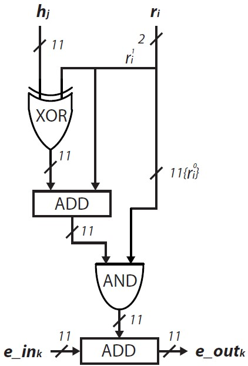

# NTRU 3Round

2024-02-28 - Eros Camacho-Ruiz (camacho@imse-cnm.csic.es)

This is the repository of the evaluation carried out in the NTRU cryptosystem presented in the [PhD Dissertation](https://github.com/ErosCamacho/PhD_Dissertation/blob/main/PhD_Thesis_Eros_Camacho_Ruiz_vFinal_rev.pdf) entitled: <b>"Design of a hardware Root-of-Trust on embedded systems"</b>

The main idea of this repository is twofold:
- Study the countermeasures proposed in the PhD with different implementations.
- Define a demo in which it is possible to stablish a PQ secure communication between two devices

<!-- TABLE OF CONTENTS -->
## Table of Contents
  <ol>
    <li><a href="#dir-struc">Directory structure</a></li>
    <li><a href="#pre-pynqz2">Prerequisites for the Pynq-Z2 platform</a></li>
    <li><a href="#pre-g2imse">Prerequisites for the IMSE platform</a></li>
	<li><a href="#pre-g2spirs">Prerequisites for the SPIRS platform</a></li>
    <li><a href="#ins">Installation</a></li>
	<li><a href="#exa">Example</a></li>
    <li><a href="#note">Note for version</a></li>
    <li><a href="#contact">Contact</a></li>
	<li><a href="#developers">Developers</a></li>
	<li><a href="#func">Functions descriptions</a></li>
  </ol>

## Directory structure <a name="dir-struc"></a>

- ntru_ms2xs_8.0: the IP module of the NTRU polynomial multiplier
- NTRU_3Round.rar: the comprised file of the NTRU software implementation and the HW call drivers
    - result_test: this folder is generated to store the performance test of the NTRU.
    - bit: stores all the embedded system integrator as bitstream to check on the tests. (see the Table below)
    - data_in: stores the input ciphertext in binary format when the demo is running.
    - data_out: stores the output ciphertext in binary format when the demo is running.
    - gen_keys: stores the generated keys.
    - pub_keys: stores the public keys of the devices to connect.
    - src: source files
        - common: Low-level drivers and utilities
        - ntru: NTRU 3Round SW libraries	
    - Makefile: to generate the executables for the library
    - Test.c: main file to tests
    - demo.c: main file to demo
- README.md: this file 

## IP Integration <a name="dir-struc"></a>

The IP module is delivered in the ```ntru_ms2xs_8.0``` folder. 



For further information, see Chapter 4 of the [PhD Dissertation](https://github.com/ErosCamacho/PhD_Dissertation/blob/main/PhD_Thesis_Eros_Camacho_Ruiz_vFinal_rev.pdf)

## Prerequisites for the Pynq-Z2 platform <a name="pre-pynqz2"></a>

1. Download the PYNQ C-API from https://github.com/mesham/pynq_api

2. So that applications can modify the clock frequency you must edit the file ```src/pynq_api.c``` to replace **0x00** with **address** on _line 327_:

    - // return PYNQ_writeMMIO(&(state->mmio_window), &write_data, **0x00**, sizeof(unsigned int));
    - return PYNQ_writeMMIO(&(state->mmio_window), &write_data, **address**, sizeof(unsigned int));

3. Then, issue ```make```. Once it is built, issue ```sudo make install```. 

## Prerequisites for the IMSE platform <a name="pre-g2imse"></a>

1. Download the corresponding bitstream of the IMSE platform: ``` example/bit/SPIRS_RoT_g2riscv-imse.bit ```. 

2. Open the Hardware Manager of Vivado. Then, program the FPGA using the bitstream.

3. Due to the amount of space required to set the SO, contact <a href="#contact">here</a> to install the SD. 

4. Copy all the repository in the SD.

## Prerequisites and considerations for the SPIRS platform <a name="pre-g2spirs"></a>

1. Download the platform provided by CEA from the SPIRS nextcloud: https://www.spirs-project.eu/nextcloud/index.php/apps/files/?dir=/SPIRS/Technical_meetings/WP5/20231206_SPIRS_Platform_delivery&fileid=65154

2. Follow the instructions to program the Genesys-2 board and write the SD.

3. ``git clone git@gitlab.com:hwsec/lib_rot_spirs.git`` in your host system at the same directory level as  ``` SPIRS_WP5_delivery``` folder.

4. After the installation of the library in the host system, and cross compilation of any file that uses any function of the library, it is necesary to copy ```RoT_SPIRS/build/librotspirs.so``` from the host system to ```/usr/lib/``` and ```/usr/lib/``` in the SPIRS platform.


## Installation <a name="ins"></a>

1. For compilation of the library use the next directives:

* For the **PYNQ-Z2 platform**
```bash
make build-pynqz2
```

* For the Genesys-2 board using the **IMSE platform** in the host system
```bash
make build-g2riscv-imse
```

* For the Genesys-2 board using the **SPIRS platform**
```bash
make build-g2riscv-spirs
```

2. Then the library has to be install:
```bash
make install
```

3. To uninstall the library:
```bash
make uninstall
```

## Example <a name="exa"></a>

* In the file ``` example/main.c ``` there is an example of each function. 
* To compile and to use the **RoT library**, it has to be used the order ```make pynqz2```, ```make g2riscv-imse``` or ```make g2riscv-spirs``` depending on the board or the platform we are using.
* To compile and to use the **RoT repository**, it has to be used the order ```make pynqz2-repo```, ```make g2riscv-imse-repo``` or ```make g2riscv-spirs-repo``` depending on the board or the platform we are using.

## Note for version <a name="note"></a>
### v. 3.0

* Eliminated the dependence of OpenSSL library
* Added the frequency reduction for PYNQZ2 board in the main.c example file.
* Reviewed the Makefile of both library and example compilation.

### v. 3.1

* Added a new functionality in the makefile of the example that can use the library or the repository.
* Added a new functionality in which it is possible to modify the number of tests that the PUF carried out in the enrollment process. It can be modified through the parameter ```E_TESTS``` in ``` RoT_SPIRS\common\common.h ```. In order to apply these changes the library must be compiled and installed again.
* Readme modified.

### v. 4.0

* Modification of the makefile that can install the library on the host system for use it on the SPIRS platform.
* Redefinition of the PUF function for the enrollment and retrieval of a random key generated with the PUF.
* Readme modified.

## Contact <a name="contact"></a>

**Eros Camacho-Ruiz** - (camacho@imse-cnm.csic.es)

_Hardware Cryptography Researcher_ 

_Instituto de Microelectrónica de Sevilla (IMSE-CNM), CSIC, Universidad de Sevilla, Seville, Spain_

## Developers <a name="developers"></a>
Eros Camacho-Ruiz, Luis F. Rojas-Muñoz, Pablo Navarro, Santiago Sánchez-Solano, Macarena C. .Martínez-Rodríguez

_Instituto de Microelectrónica de Sevilla (IMSE-CNM), CSIC, Universidad de Sevilla, Seville, Spain_

## Functions descriptions <a name="func"></a>

### SHA2-256
**sha2_256**(unsigned char* in, unsigned char* out, unsigned long long int length, MMIO_WINDOW ms2xl, int DBG)

1. in : input message
2. out: output hash
3. length : length of the message 
4. ms2xl: register window (use as in the example)
5. DBG: print debug level

### SHA3-512
**sha3_512**(unsigned char* in, unsigned char* out, unsigned long long int length, MMIO_WINDOW ms2xl, int DBG)

1. in : input message
2. out: output hash
3. length : length of the message
4. ms2xl: register window (use as in the example)
5. DBG: print debug level

### AES 128
**aes_128_enc**(MMIO_WINDOW aesWindow, unsigned char* aesOutput_char, unsigned char* aesInput_char, unsigned char* key_char, int iter, int DBG)

1. aesWindow: register window (use as in the example)
2. aesOutput_char: output ciphertext  (128 bit-block)
3. aesInput_char: block of 128 bits of the plaintext message
4. key_char: 128-bit key
5. iter: if 0, it is working in the 1st iteration then capture the key, otherwise it does not capture the key
6. DBG: print debug level

**aes_128_dec**(MMIO_WINDOW aesWindow, unsigned char* aesOutput_char, unsigned char* aesInput_char, unsigned char* key_char, int iter, int DBG)

1. aesWindow: register window (use as in the example)
2. aesOutput_char: output plaintext  (128 bit-block)
3. aesInput_char: block of 128 bits of the ciphertext message
4. key_char: 128-bit key
5. iter: if 0, it is working in the 1st iteration then capture the key, otherwise it does not capture the key
6. DBG: print debug level

### AES 256

**aes_256_enc**(MMIO_WINDOW aesWindow, unsigned char* aesOutput_char, unsigned char* aesInput_char, unsigned char* key_char, int iter, int DBG)

1. aesWindow: register window (use as in the example)
2. aesOutput_char: output ciphertext  (256 bit-block)
3. aesInput_char: block of 256 bits of the plaintext message
4. key_char: 256-bit key
5. iter: if 0, it is working in the 1st iteration then capture the key, otherwise it does not capture the key
6. DBG: print debug level

**aes_256_dec**(MMIO_WINDOW aesWindow, unsigned char* aesOutput_char, unsigned char* aesInput_char, unsigned char* key_char, int iter, int DBG)

1. aesWindow: register window (use as in the example)
2. aesOutput_char: output plaintext  (256 bit-block)
3. aesInput_char: block of 256 bits of the ciphertext message
4. key_char: 256-bit key
5. iter: if 0, it is working in the 1st iteration then capture the key, otherwise it does not capture the key
6. DBG: print debug level

### EDDSA

**sign_eddsa**(MMIO_WINDOW my_window, unsigned char *secret, unsigned char *msg, int len_msg, unsigned char *signature, int DBG)

1. my_window: register window (use as in the example)
2. secret : 256-private key
3. msg: input message
4. len_msg : length of the message
5. signature: output signature
6. DBG: print debug level

int **verify_eddsa**(MMIO_WINDOW my_window, unsigned char *public, unsigned char *msg, int len_msg, unsigned char *signature, int DBG)

1. my_window: register window (use as in the example)
2. public : 256-public key
3. msg: input message
4. len_msg : length of the message 
5. signature: input signature
6. DBG: print debug level

### PUF

**puf**(MMIO_WINDOW puf_window, int chal, int K_bits, int RC,  int PufID, unsigned char* out)

1. puf_window: : register window (use as in the example)
2. chal: if 1 performs enrollment, otherwise retreive a key
3. K_bits: set output key length
4. RC: repitition code to perform retrieval process
5. PufID: label each of the two instanciated PUFs
6. out: output key
		
**trng**(MMIO_WINDOW puf_window,int K_bits, unsigned char* out)

1. puf_window: : register window (use as in the example)
2. K_bits: set output random number length
3. out: output random number

