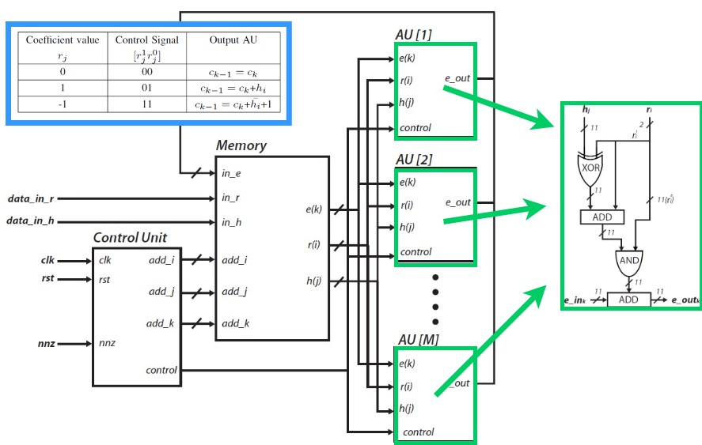
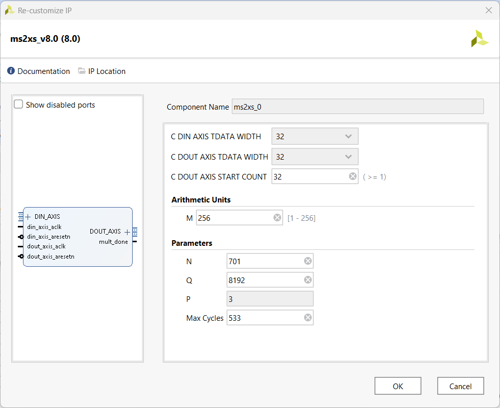
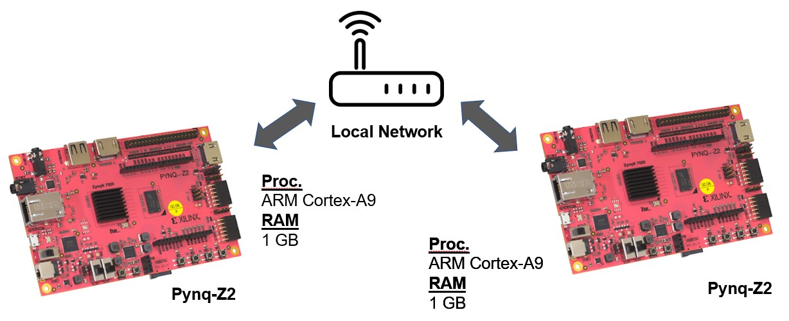

# NTRU 3Round

2024-02-28 - Eros Camacho-Ruiz (camacho@imse-cnm.csic.es)

This is the repository of the evaluation carried out in the NTRU cryptosystem presented in the [PhD Dissertation](https://github.com/ErosCamacho/PhD_Dissertation/blob/main/PhD_Thesis_Eros_Camacho_Ruiz_vFinal_rev.pdf) entitled: <b>"Design of a hardware Root-of-Trust on embedded systems"</b>

The main idea of this repository is twofold:
- Study the countermeasures proposed in the PhD with different implementations.
- Define a demo in which it is possible to stablish a PQ secure communication between two devices

*Note: All the content of this repository has been implemented using the Pynq Framework.*

<!-- TABLE OF CONTENTS -->
## Table of Contents
  <ol>
    <li><a href="#dir-struc">Directory structure</a></li>
    <li><a href="#ip-integ">IP Integration</a></li>
    <li><a href="#pre-pynqz2">Prerequisites for the Pynq-Z2 platform</a></li>
    <li><a href="#pre-g2imse">Prerequisites for the IMSE platform</a></li>
	<li><a href="#pre-g2spirs">Prerequisites for the SPIRS platform</a></li>
    <li><a href="#ins">Installation</a></li>
	<li><a href="#exa">Example</a></li>
    <li><a href="#note">Note for version</a></li>
    <li><a href="#contact">Contact</a></li>
	<li><a href="#developers">Developers</a></li>
	<li><a href="#func">Functions descriptions</a></li>
  </ol>

## Directory structure <a name="dir-struc"></a>

- ntru_ms2xs_8.0: the IP module of the NTRU polynomial multiplier
- NTRU_3Round.rar: the comprised file of the NTRU software implementation and the HW call drivers
    - result_test: this folder is generated to store the performance test of the NTRU.
    - bit: stores all the embedded system integrator as bitstream to check on the tests. (see the Table below)
    - data_in: stores the input ciphertext in binary format when the demo is running.
    - data_out: stores the output ciphertext in binary format when the demo is running.
    - gen_keys: stores the generated keys.
    - pub_keys: stores the public keys of the devices to connect.
    - src: source files
        - common: Low-level drivers and utilities
        - ntru: NTRU 3Round SW libraries	
    - Makefile: to generate the executables for the library
    - Test.c: main file to tests
    - demo.c: main file to demo
- README.md: this file 

## IP Integration <a name="ip-integ"></a>

The IP module is delivered in the ```ntru_ms2xs_8.0``` folder. The design of the core part of the IP module is depicted in the next figure. The arithmetic unit (AU) is shown 
in the green box. The three different operation modes are ruled by the coefficients of the blind polynomial: -1,1 and 0. The parameter ```M``` is depicted as paralellization 
coefficient that means the number of AUs are working in parallel. 



The IP integration is finished adding an user interface in which it is possible to modify the next parameters of the polynomial multiplier:
- ```M```: is the number of AUs that are working in parallel.
- ```N```: the number of the coefficients of the polynomial. See NTRU documentation.
- ```Q```: is the number that symbolizes the modQ reduction in the polynomial ring. 
- ```max_cycles```: is the number of maximum cycles it is possible to accelerate the algorithm avoind timing attacks. See PhD Dissertation.



The next table shows all the implementations delivered in this repository. There are in total 8 different strategies: 4 parameters set in the NTRU where in each one the
`max_cycles` value was set in `N` and `CL` (Confident Limit). From each configuration there are different values of `M`: `1,2,3,4,5,6,7,8,9,10,11,12,13,14,15,16,32,64,128,256`.
That is basically the content of the folder `NTRU_3Round.rar\bit\`. As a final user, you can discard (and remove) other implementations and remake the embedded integration using the 
configuration more suitable for your interest. 

| Parameter set |  `N`  | `CL` |
| :------------ | --- | --- |
| `ntruhps2048509` | 509 | 400 |
| `ntruhps2048677` | 677 | 516 |
| `ntruhps2048821` | 821 | 625 |
| `ntruhrss2048701` | 701 | 533 |

For further information, see Chapter 4 of the [PhD Dissertation](https://github.com/ErosCamacho/PhD_Dissertation/blob/main/PhD_Thesis_Eros_Camacho_Ruiz_vFinal_rev.pdf)

## Prerequisites for the Pynq-Z2 platform <a name="pre-pynqz2"></a>

1. Download the PYNQ C-API from https://github.com/mesham/pynq_api

2. Then, issue ```make```. Once it is built, issue ```sudo make install```. 

## Installation and Use of the Test <a name="ins"></a>

1. For compilation of a specific test:

```bash
make Test_N_VALUE
```

where `N_VALUE` can be: `509, 677, 821, 701`. So, for example if the user wants to compile something related with the parameter set `ntruhps2048509`, 
they must issue: `make Test_509`

2. For the use, the program has different input variables:
	- `-h` : Show the help.
	- `-hh` : Show the extended help.
	- `-n` : Number of test to perform.
	- `-M` : Paralelization coefficient. *Note: For that there must be a bitstream in the folder `N/CL/M`.
	- `-y` : CL parameter.
	
	Also it includes options to debug different parts:
	- `-d` : debug level
	- `-c` : number of coefficients to show in the debug. *In order to avoid a data massification on the screen.* 
		- `DBG == 0`: Minimize the print in window.
		- `DBG == 1`: Show the time in each part of the algorithm.
		- `DBG == 2`: Show the extended evaluation of time.
		- `DBG == 3`: Show the coefficients of SW and HW.
		- `DBG == 4`: Show the multiplication operation in SW.
		- `DBG == 5`: Show the multiplication operation in HW.
		- `DBG == 6`: Show the public key.
		- `DBG == 7`: Show the seed and he coefficients of r and h.
		- `DBG == 8`: Show the multiplication operation in SW 3 ROUND.
		- `DBG == 9`: Show the cuphertext of 3 ROUND, LIBNTRU, HW.
		- `DBG == 10`: Show the hash of rm.
		- `DBG == 11`: ***ONLY FOR PERFORMING THE SEED ANALYSIS.*** It generates the file `r.txt` .

An example, if it is desired to performance 1000 tests on the `ntruhps2048509` parameter set, using a confident limit of 400 with a parallelization coefficient of 10, 
it has to be typed: `Test_509 -n 1000 -M 10 -y 400`

## Installation and Use of the Demo <a name="ins"></a>

The main idea of the Demo is to interconnect two devices and share information using PQC as the next figure shows. In this case, two Pynq platforms are interconnected 
in a local network. The two of them are going to generate the key pair (public and private keys). Then, one of them is going to recive the public key of the other one using 
this key to encapsulate a shared secret. Then the ciphertext generated (with the information of the shared secret) is sent to the other platform that will use the 
private key to decapsulate and extract the shared secret. 



1. For compilation of a specific demo:

```bash
make Demo_N_VALUE
```

where `N_VALUE` can be: `509, 677, 821, 701`. So, for example if the user wants to compile something related with the parameter set `ntruhps2048509`, 
they must issue: `make Demo_509`

2. For the use, the program has different input variables:
	- `-h` : Show the help.
	- `-k` : Key generation.
	- `-e` : Encapsulation. 
	- `-d` : Decapsulation.
	
	Also it includes verbose options:
	- `-v` : verbose level level
		- `1`: Show only functions.
		- `2`: Show intermediate results.
		- `3`: Show keys.

## Example of the Demo <a name="ins"></a>

A demo video example can be seen in the next [link](https://saco.csic.es/index.php/s/Ze9GETKY7zzMJ23). 

For the example, two platforms will be used: $${\color{red}#PLATFORM_1}$$ and <code style="color : magenta">#PLATFORM_2</code>


## Note for version <a name="note"></a>
### v. 1.0

* Reordered the repository structure.
* Added a Readme file. 

## Contact <a name="contact"></a>

**Eros Camacho-Ruiz** - (camacho@imse-cnm.csic.es)

_Hardware Cryptography Researcher_ 

_Instituto de Microelectrónica de Sevilla (IMSE-CNM), CSIC, Universidad de Sevilla, Seville, Spain_

## Developers <a name="developers"></a>
Eros Camacho-Ruiz

_Instituto de Microelectrónica de Sevilla (IMSE-CNM), CSIC, Universidad de Sevilla, Seville, Spain_


